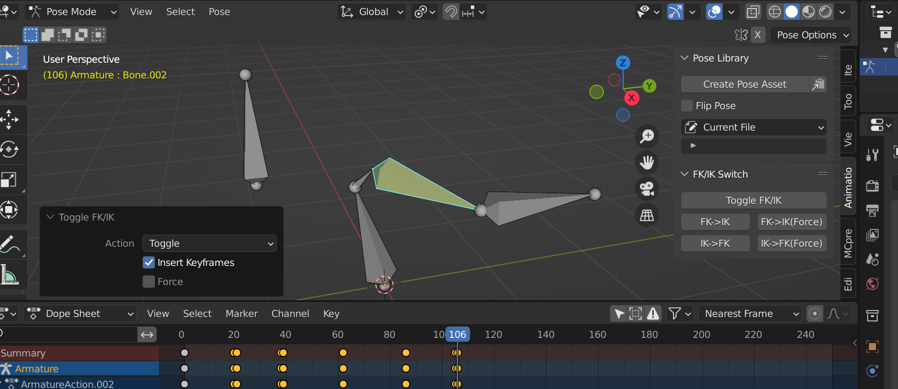
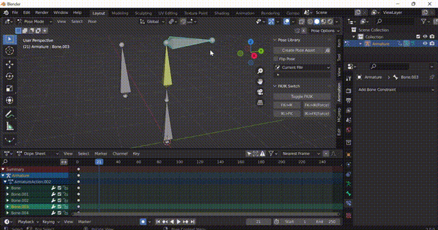

# blender-FK-IK-switch

blender FK/IK switch addon

A simple addon to turn on/off IK constraint while keeping the bones in-place.

## Features

- switch IK to FK while keeping bones in-place
- switch FK to IK, moving IK target and pole to the best fit location
- auto key frames
  
## How to install/use

### Install

- In blender, open preference, Addons, click install, and select `fk_ik_switch.py` in the `fk_ik_switch` folder.
- Switch on the addon.
- Done!

### Usage

Select some bones with ik constraints and click "Toggle FK/IK"!

You can find all operations under `3D View` -> `Side panel` -> `Animation Tab`(pose mode) -> `FK/IK Switch` panel.

**Options:**
- **Action**
  - **Toggle:** turn FK to IK and IK to FK. Each bone chain is calculated separately, so you can select multiple FK/IK bone chain.
  - **FK->IK:** turn FK to IK. Do nothing if already in IK.
  - **IK->FK:** turn IK to FK. Do nothing if already in FK.

- **Insert Keyframes:** Auto insert keyframes on bones and constraint influence if checked.

- **Force:** If on, the operation will be done even if the bone is already in the wanted mode (i.e. bone is in IK and FK to IK is clicked, and vice versa)

**Notice:**

- Bones must already have a IK constraint on them, the addon will not add that for you.
- You can do the operation on multiple bones/bone chains at the same time.

## Contribution/Bug report/Feature requests

For contribution, simply start a pull request. Try to keep code clean and well documented

For bug reports or feature requests, start an issue in the issues tab.
